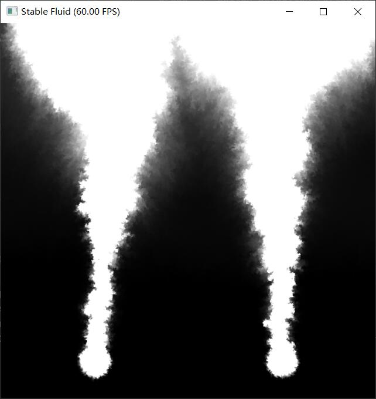
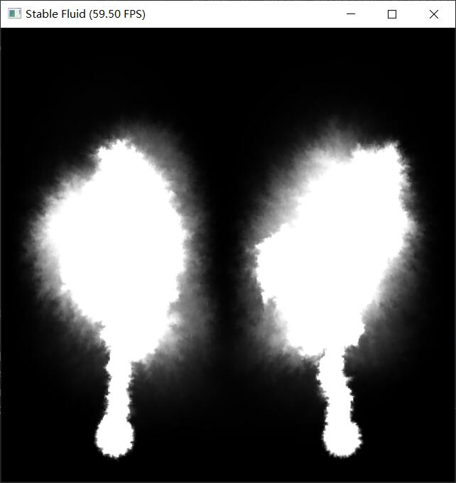

# 太极图形课S1-大作业

## 作业来源
> 基于课程11的 stable_fluid 代码添加 advection reflection，maccormack, MGPCG


#### 运行环境：
> [Taichi] version 0.8.7, llvm 10.0.0, commit 88d81df6, win, python 3.7.7
#### 运行：
 -   `python stable_fluid.py`: use the jacobi iteration to solve the linear system.
 -   `python stable_fluid.py -S`: use a sparse matrix to do so.
 -   `python stable_fluid.py -M`: use MGPCG
 -    press 'A' switch advection reflection
 -    press 'C' show curl field
 -    press 'V' show velocity field
 -    press 'S' enhance vortex
 -    You can change MGPCG and Jacobi iteration to change precision

## 效果展示
 - impulse


- smoke


## 整体结构
```
-LICENSE
-|data
-README.MD
-stable_fluid.py
-PCG_Solver.py
```
 - scene choice
 - use_spray   # which change velocity a lot, you can test reflection without projection
 - use_smoke  # 2 smoke source
 - use_impulse  # drag impulse

## 实现细节：
> maccormack: 首先插值当前位置得到q, 然后以当前速度场backtrace位置p_new，差值得到 new_q, 再用得到的p_new 用 -dt backtrace p_aux, 插值得到 q_aux,
> error = q - q_aux , q更新为 q = q_new + 0.5 * error， 最后记得对 q 检查是否超出 p_new 所在格点 四个 q 值, 可以参考Games201第四课理解


> advection_reflction: 先 advect 0.5dt, 得到 advected_v, 再对advected_v project, 得到 projected_v, reflected_v = 2 * projected_v - advected_v
> 再以 projected_v当速度场 advect prejected_v 得到最后速度, 如果速度场散度变化很大，需要 再对 速度 project


> MGPCG: 经典conjugate gradient 用 multigrid 做 预条件，参考 Games201第四课及mgpcg代码

## 分析比较
> 在smoke，和 spray 场景中有 '源' 不断产生新的速度，如果要精确解出Ax = b jacobi,mgpcg，sparse matrix 几乎相同的消耗
因此这种场景不如用Jacobi，容易实现

> advection refletion 能一定程度上加快收敛, 减小残差
- 40ite_jacobi_without_reflection





- 40ite_jacobi_with_reflection



- reference_sparse_matrix


> 如果速度场散度变化很大，需要 再对 速度 project, （如果解算器不准的话，视觉上也没有太大问题，但如果残差小，速度场会发生剧烈抖动）

- Reflection_without_projection


